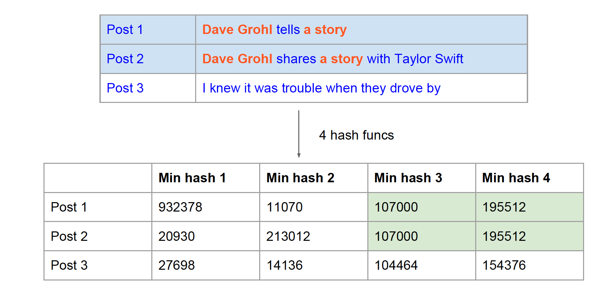
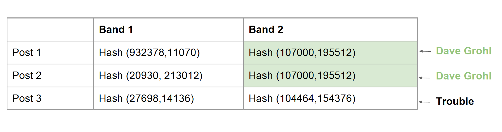
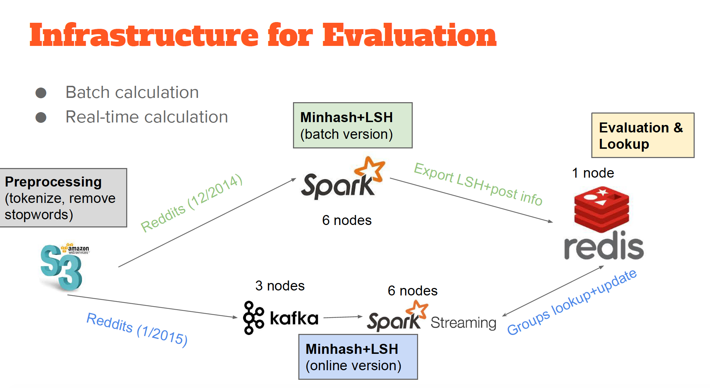
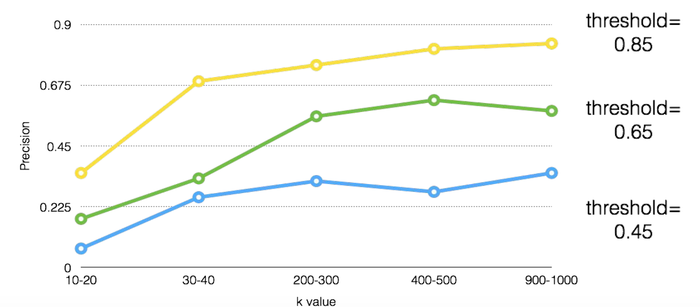
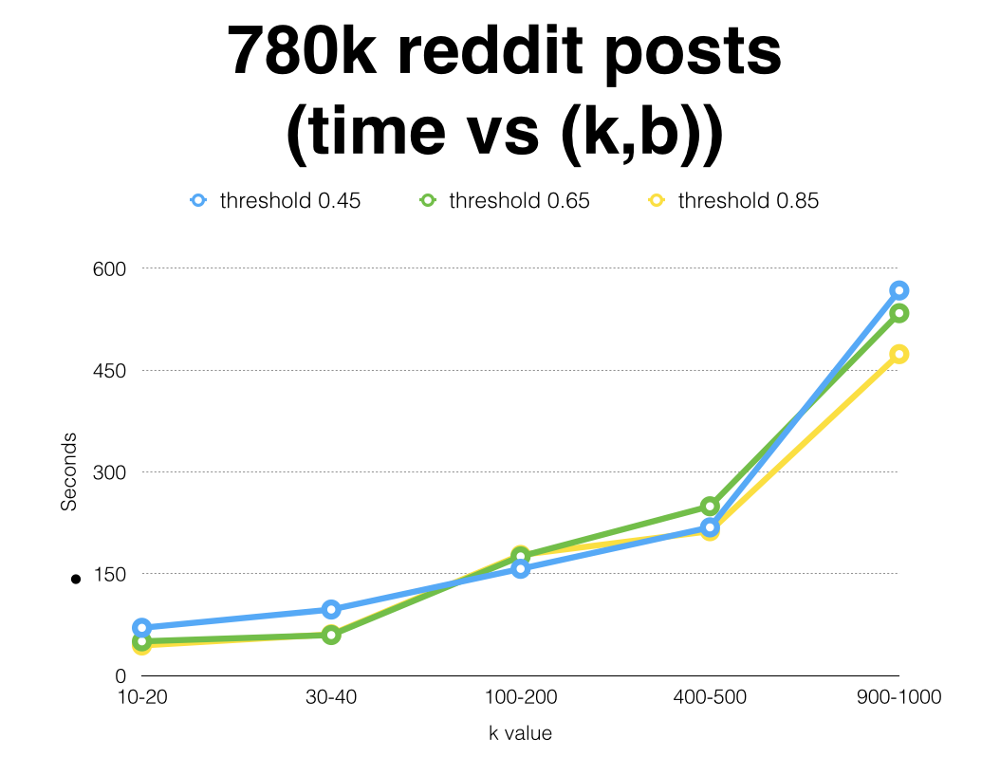
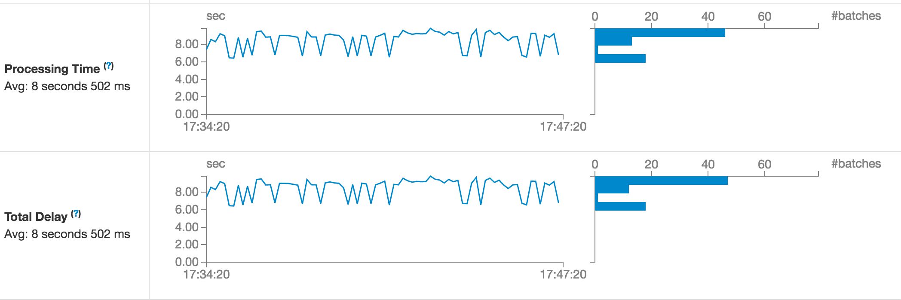

# Benchmark MinHash+LSH algorithm on Spark
* Insight Data Engineering Fellow Project

## Motivation: Explore approximate neighbor searching

This project is motivated by speeding up neighbor searching for recommendation/classification algorithms. Even for the most straightforward algorithm, KNN, the naive brute-force implementation takes O(n^2)*O(similarity calculation). In the graduate school, I learned to implement LSH + Random Projection approach to speed up KNN with cosine similarity. For this project, I'm exploring another variant of LSH algorithm: MinHash + LSH for speeding up neighbor search wrt Jaccard Similarity ("Mining massive datasets", Rajaraman and Leskovec). Jaccard Similarity is really useful for finding similar documents (e.g. plagirism) and sequences. I'm interested in implementing and benchmarking this algorithm in both batch and real-time mode on the distirbuted system (Spark, Kafka and Redis).

## MinHash + LSH Implementation

First of all, let's define our task is to recommend posts based on Jaccard Similarity of texts. Now suppose we have three posts in the pool. It's quite obvious to see first two posts are almost the same. MinHash algorithm basically applies k hash functions on the list of tokens and calculate the min value for each function. Now we converted the tokens into the following hash value table:

However, still some work to be done. The time complexity is now O(kN) for pairwise lookups. In order to further reduce the search space, LSH is introduced to divide the hash value table into b bands and r rows (each band combines r rows). Then re-hash and generate the following table:

There're few nice things about this approach: 1. it effectively reduces the search space utilizing the collision property of Hashing. Now the buckets become (band id, band hash). If two posts have the same chunks, they should be hashed to the same bucket. 2. It provides an estimated threshold (lowerbound): the likelihood of two similar items in the same group > 1/2. The threshold is approximately (1/b)^(1/r). By changing band width (r) and number of bands (b), we can adjust the similarity lowerbound in order to filter out irrelevant pairs. It will be extremely useful for finding top K similar items. This feature is evaluated later in the Evaluation section.

## Pipeline

The pipeline is designed for both batch and real-time benchmark of MinHash+LSH algorithm. The data are reddit posts in 12/2014 (for batch) and 1/2015 (for real-time). They're preprocessed (tokenize & remove stopwords) and stored in S3. For the batch processing, data flows from S3 into Spark for batch version of the algorithm (MapReduce) and brute-force method (join). Then the calculated results (e.g. band id and groupings, post information) are stored in Redis database, a key-value store for fast lookups and writes. For the real-time part, kafka sends data at different rates (to mimic new posts) to Spark streaming. Then the iterative, online version of the algorithm is running on Spark Streaming and it updates and looks up data from Redis.

## Evaluation
* Batch:
   First of all, I compared the time and number of shuffles between brute-force and MinHash+LSH algorithm. From the experiment on 780k entries of Reddit posts, MinHash+LSH achieves 4000X speed up mainly because it filters out a lot of pairs in the band hash grouping.

   

   Secondly, I wanted to investigate the effect of K (# hash functions), b and r on time complexity and precision (% pairs which have similarity levels above the threshold). Based on the following results, we can see that the precision value is increasing when k and threshold value are increasing. Even though fewer items are filtered, but more items are actually similar. For this dataset, medium size of k (~200 to 300) works pretty well.
   
   
   
   

* Streaming:
   Streaming evaluation is conducted when 340 events/sec are sent from Kafka to Spark Streaming. It takes 8 sec to finish processing 10 sec window (6 t4.xlarge nodes, 1024 MB).
   

## Limitations & Conclusion
* Experiment Settings:
  1. Recall value is not collected for more parameter combinations due to the time limit. Otherwise we can evaluate how the threshold level/k value affects the recall value. And we can see how many similar items are filtered out.
  2. Streaming evaluation is not as complete as batch evaluation, since this algorithm can bring major speed up on batch job. The purpose of streaming part is to see how it handles online peak usage. If time is permitted, I should conduct a more comprehensive benchmark.
  3. Only used relatively small dataset.
* Algorithm:
  1. This algorithm may filter out or include item pairs which are not similar (precision&recall). 
  2. This algorithm works specifically for jaccard similarity. If you want to calculate approximate neighbors for other similarity metrics, please refer to this paper: https://arxiv.org/pdf/1408.2927.pdf.
* Application:
  1. Tune the parameters in order to find the better balance between time and precision value. 
  2. Use higher similarity level (above 60%) to speed up neighbor searching. Even though the algorithm may fail finding neighbors for several items which are unique/new, the solution could be either linear scan for exact search or select a non-personalized/most popular item as a neighbor.

